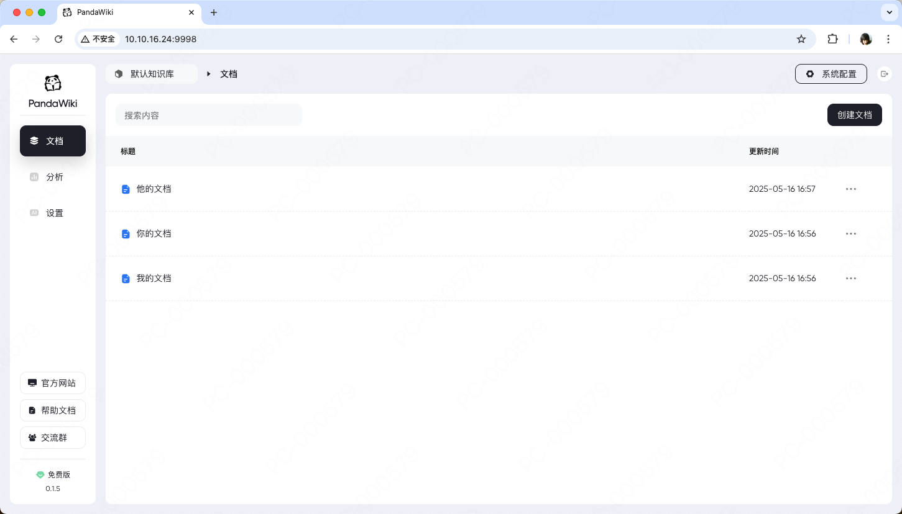
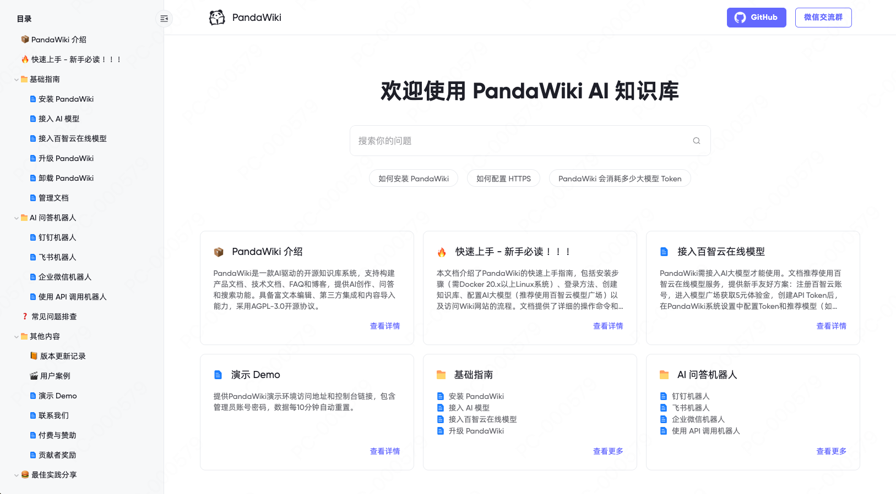
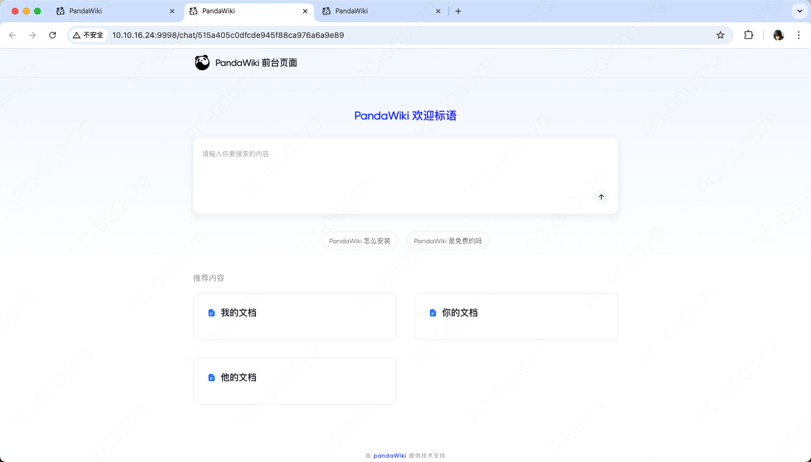
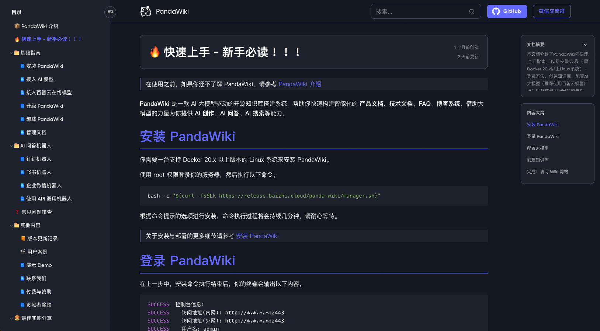

<p align="center">
  
</p>


<p align="center">
  <a target="_blank" href="https://ly.safepoint.cloud/laA8asp">🏠 官网</a> &nbsp; | &nbsp;
  <a target="_blank" href="https://ly.safepoint.cloud/w2AeHhb">📖 帮助文档</a> &nbsp; | &nbsp;
  <a target="_blank" href="https://ly.safepoint.cloud/hSMd4SH">🔍 演示 Demo</a> &nbsp; | &nbsp;
  <a target="_blank" href="https://discord.gg/SVnZGzHFvn">🙋‍♂️ 微信交流群</a>
</p>

## 👋 项目介绍

PandaWiki 是一个 AI 驱动的开源 Wiki 搭建系统，提供强大的文档编辑、管理和协作功能。

## 🔥 功能与特色

- 支持使用 AI 大模型对 Wiki 内容进行检索和总结。
- 富文本编辑能力简洁又强大，支持导出为 word、pdf、markdown 等多种格式。
- 支持多用户协作管理。
- 支持快速与钉钉、飞书、企业微信等 IM 工具对接 Wiki。

## ⚡️ 截图

|  |  |
| ------------------------------------------------- | ------------------------------------------------- | 
|  |  | 

查看 [演示 Demo](https://baizhi.cloud/)

## 🚀 上手指南

### 环境需求

安装 `PandaWiki` 前请确保你的系统环境符合以下要求

- 操作系统：Linux
- CPU 指令架构：x86_64
- 软件依赖：Docker 20.10.14 版本以上
- 软件依赖：Docker Compose 2.0.0 版本以上
- 推荐资源：1 核 CPU / 2 GB 内存 / 10 GB 磁盘
- 最低资源：1 核 CPU / 1 GB 内存 / 5 GB 磁盘

### 📦 一键安装

使用 root 权限执行以下命令进行安装

```bash
bash -c "$(curl -fsSLk https://baizhi.cloud/release/pandawiki/manager.sh)"
```

### ⚙️ 初始化

#### 访问 PandaWiki 控制台

安装完成后，控制台默认监听在 9998 端口，使用浏览器访问 http://127.0.0.1:9998 就能看到登录页面。

默认账号密码会在安装时随机生成，请查看安装命令的输出内容。

#### ⚙️ 配置 AI 大模型

在  PandaWiki 控制台的右上角点击 **系统配置** 按钮，在弹出窗口中配置供 PandaWiki 使用的大模型。

> PandaWiki 目前支持接入以下大模型
> 
> - **DeepSeek**：参考文档 [DeepSeek](https://platform.deepseek.com/)
> - **OpenAI**：ChatGPT 所使用的大模型，参考文档 [OpenAI](https://platform.openai.com/)
>- **Ollama**：Ollama 通常是本地部署的大模型，参考文档 [Ollama](https://github.com/ollama/ollama/tree/main/docs)
>- **硅基流动**：参考文档 [SiliconFlow](https://docs.siliconflow.cn/)
>- **月之暗面**：Kimi 所使用的模型，参考文档 [Moonshot](https://platform.moonshot.cn/)
> - **其他**：其他兼容 OpenAI 模型接口的 API

#### 💪 开始使用

完成以上配置后你就可以开始 PandaWiki 了，开始创建文档，并使用 AI 问答功能吧。

## 🙋‍♂️ 贡献

欢迎提交 [Pull Request](https://github.com/chaitin/PandaWiki/pulls) 或创建 [Issue](https://github.com/chaitin/PandaWiki/issues) 来帮助改进项目。

## 📝 许可证

本项目采用 GNU Affero General Public License v3.0 (AGPL-3.0) 许可证。这意味着：

- 你可以自由使用、修改和分发本软件
- 你必须以相同的许可证开源你的修改
- 如果你通过网络提供服务，也必须开源你的代码
- 商业使用需要遵守相同的开源要求
